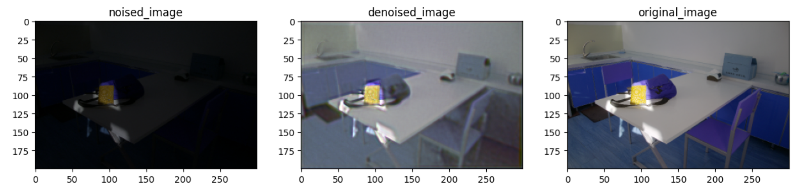

# Enhanced Deep Super-Resolution (EDSR) Model with Gradient Accumulation

## Table of Contents
- [Introduction](#introduction)
- [Model Architecture](#model-architecture)
- [Results](#results)

## Introduction

This repository contains the implementation of the Enhanced Deep Super-Resolution (EDSR) model for single-image super-resolution tasks. The model leverages deep residual learning to effectively reconstruct high-frequency details from low-resolution images. Gradient accumulation is utilized to enable training on larger models without encountering memory constraints.

The EDSR model is based on the paper:
- **Enhanced Deep Residual Networks for Single Image Super-Resolution** by Bee Lim et al. (2017) [EDSR Paper](https://arxiv.org/abs/1707.02921)

## Model Architecture

The EDSR model consists of:
- An initial convolutional layer followed by ReLU activation.
- Multiple residual blocks with two convolutional layers and ReLU activation.
- A final convolutional layer to produce the output image.
- Skip connections for residual learning.

## Achieved PSNR value
The Peak Signal-to-Noise Ratio (PSNR) measures the quality of denoised images compared to their original 
counterparts. 17.09 dB was achieved, demonstrating effective noise reduction and preservation of image 
fidelity. 

## RESULTS 

